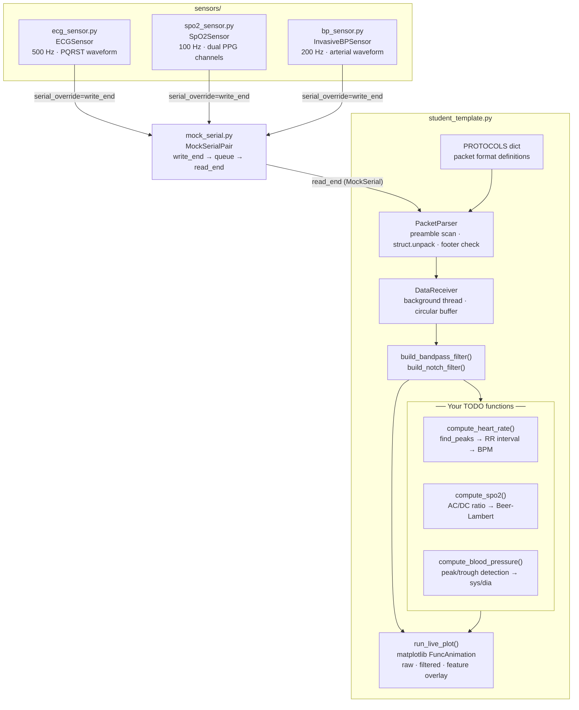
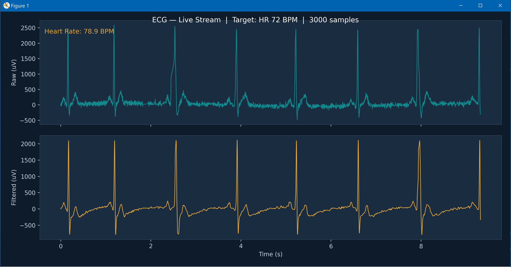
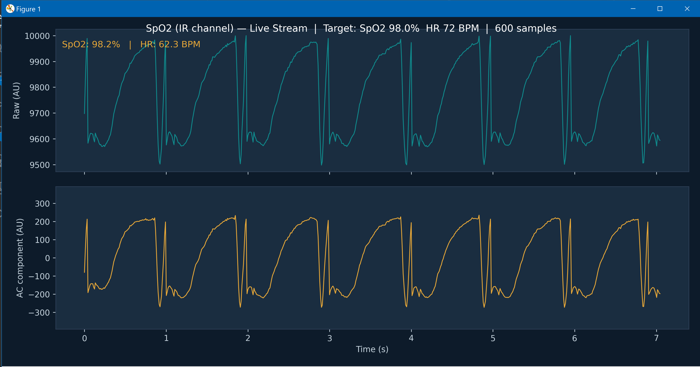

# Simulated Medical Device Data Demo

This is version 1 of an experimental demo series for introducing students to different types of data and filtering without hardware. The demo simulates three clinical waveforms; ECG, SpO₂, and invasive blood pressure. These are streamed as binary packets over a mock serial transport, mirroring the data pipeline of a real bedside monitor. Students work through parsing, filtering, and feature extraction on live data using only standard Python libraries, with no physical devices or drivers required. 


View the [AI Disclosure](#ai-disclosure) at the end of this document for more information.


---

## Table of Contents

* [What This Is](#what-this-is)
* [Architecture](#architecture)
* [File Layout](#file-layout)
* [Requirements](#requirements)
* [Run It](#run-it)
* [Switch Sensors](#switch-sensors)
* [Example Output](#example-output)
* [Your Exercise](#your-exercise)
* [Sensor Packet Formats](#sensor-packet-formats)
* [How the Mock Serial Works](#how-the-mock-serial-works)
* [Key Concepts from the Lecture](#key-concepts-from-the-lecture)
* [AI Disclosure](#ai-disclosure)

---

## What This Is

A complete medical device data pipeline running entirely on your laptop —
no COM ports, no drivers, no second terminal. The sensor runs in a background
thread and streams data directly into your script through an in-memory queue.

This version is functionally identical to a real serial-port setup.
The only difference is transport: instead of bytes travelling over a physical
COM port, they travel through a Python `queue.Queue`. The framing, packet
format, filter, and feature extraction code is unchanged — and identical to
what you would write against real hardware.

---

---

## Architecture

The diagram below shows how the components in `src/` connect at runtime when
`student_template.py` is running.



## File Layout

```
data_interfacing_demo/
├── media/
│   ├── ecg_live.png            ECG live plot screenshot
│   ├── spo2_live.png           SpO2 live plot screenshot
│   └── bp_live.png             Invasive BP live plot screenshot
└── src/
    ├── mock_serial.py          Drop-in queue-based serial replacement
    ├── sensors/
    │   ├── __init__.py
    │   ├── ecg_sensor.py       ECG class  (500 Hz, PQRST waveform)
    │   ├── spo2_sensor.py      SpO2 class (100 Hz, dual PPG channels)
    │   └── bp_sensor.py        IBP class  (200 Hz, arterial waveform)
    ├── student_template.py     YOUR WORKING FILE — complete the TODOs
    └── README.md               This file
```

---

## Requirements

This demo can be setup by running one of the following in your terminal.

Install minimum requirements manually:
```bash
pip install numpy scipy matplotlib
```

Install all requirements using `requirements.txt`
```bash
pip install -r requirements.txt
```

There are no drivers or serial libraries required for this demo.

---

## Run It

From inside `data_interfacing_demo/src/`:

```bash
python student_template.py
```

A live plot will appear with raw (teal) and filtered (amber) waveforms
scrolling in real time. The feature readout at the top of the raw panel
will show `"implement compute_heart_rate() ↑"` until you complete the TODO.

> **Note:** Make sure you run from the `src/` directory, not from the project
> root — Python needs to find `mock_serial.py` and the `sensors/` package
> in the same folder as `student_template.py`.

---

## Switch Sensors

Edit the configuration block at the top of `student_template.py`:

```python
SENSOR      = "ecg"    # "ecg" | "spo2" | "bp"
HEART_RATE  = 72       # BPM   (all sensors)
SPO2_TARGET = 98.0     # %%    (SpO2 only)
SYS_MMHG    = 120.0    # mmHg  (BP only)
DIA_MMHG    = 80.0     # mmHg  (BP only)
```

Save the file and re-run. The sensor, filters, and feature extraction all
reconfigure automatically based on `SENSOR`.

---

---

## Example Output

The screenshots below show what the live plot looks like for each sensor
once the script is running. The top panel shows the raw signal; the bottom
panel shows the filtered signal. The feature readout in the top-left updates
live once you implement the TODO functions.

### ECG — 500 Hz, PQRST Morphology

<p align="center">
        
</p>
   <p align="center">ECG live plot screenshot</p>

*Raw ECG (teal) with 0.5–40 Hz bandpass + 60 Hz notch filtered overlay (amber).
R-wave peaks are clearly visible; your `compute_heart_rate()` should detect them.*


### SpO2 — 100 Hz, dual PPG channels

<p align="center">
        
</p>
   <p align="center">SpO2 live plot screenshot</p>

*IR channel PPG waveform with 0.5–8 Hz bandpass. The dicrotic notch is visible
on the filtered trace. Your `compute_spo2()` uses both the red and IR channels
to compute the R-ratio.*

### Invasive BP — 200 Hz, arterial waveform

<p align="center">
        
</p>
   <p align="center">Invasive BP live plot screenshot</p>

*Arterial pressure waveform with 0.5–20 Hz bandpass + 60 Hz notch. The rapid
systolic upstroke and dicrotic notch are visible. Your `compute_blood_pressure()`
detects the systolic peak and diastolic trough.*

## Your Exercise

Complete the three `TODO` functions in `student_template.py`. Everything else
— serial transport, packet parsing, filtering, plotting — is already written.
Read the scaffold before you start; understanding it is part of the exercise.

| Function | Active when | What to implement |
|---|---|---|
| `compute_heart_rate()` | ECG or SpO2 | Peak detection → BPM |
| `compute_spo2()` | SpO2 | Red/IR AC:DC ratio → SpO2 % |
| `compute_blood_pressure()` | IBP | Peak/trough detection → sys/dia mmHg |

Each function has a detailed docstring explaining the algorithm and a
starter skeleton you can uncomment and fill in.

**Verifying your answers:** the plot title always shows the target value
(e.g. `Target: HR 72 BPM`). Your computed feature should converge to that
number within a few seconds of the plot opening.

---

## Sensor Packet Formats

The wire format is real binary — struct-packed bytes with preamble framing
and a footer, exactly as you would see on a physical serial port.

### ECG (`ecg_sensor.py`)
```
[0xAA][0xBB] | uint32 timestamp_ms | int16 sample_uV | [0xFF]

Byte 0-1  : preamble
Byte 2-5  : timestamp in ms since stream start (big-endian uint32)
Byte 6-7  : ECG voltage in microvolts, e.g. 1250 = 1.250 mV (big-endian int16)
Byte 8    : footer
Total     : 9 bytes per packet @ 500 Hz
```

### SpO2 (`spo2_sensor.py`)
```
[0xCC][0xDD] | uint32 timestamp_ms | int16 red | int16 ir | uint8 spo2 | [0xFE]

Byte 0-1  : preamble
Byte 2-5  : timestamp (big-endian uint32)
Byte 6-7  : red channel 660 nm (big-endian int16, arbitrary units)
Byte 8-9  : IR channel 940 nm  (big-endian int16, arbitrary units)
Byte 10   : device-reported SpO2 %% (uint8)
Byte 11   : footer
Total     : 12 bytes per packet @ 100 Hz
```

### Invasive BP (`bp_sensor.py`)
```
[0xBB][0xCC] | uint32 timestamp_ms | int16 pressure*10 | uint8 sys | uint8 dia | [0xEE]

Byte 0-1  : preamble
Byte 2-5  : timestamp (big-endian uint32)
Byte 6-7  : pressure in 0.1 mmHg units, e.g. 1205 = 120.5 mmHg (big-endian int16)
Byte 8    : last detected systolic mmHg (uint8)
Byte 9    : last detected diastolic mmHg (uint8)
Byte 10   : footer
Total     : 11 bytes per packet @ 200 Hz
```

---

## How the Mock Serial Works

`mock_serial.py` creates a matched pair of objects sharing one `queue.Queue`:

```
Sensor thread                        Student thread
  write_end.write(packet)  →  [queue]  →  read_end.read(n)
```

`MockSerial.read(n)` blocks until `n` bytes are available — exactly like
`serial.Serial.read(n)` from pyserial. The `PacketParser` in
`student_template.py` cannot tell the difference between the two.

This pattern is used in professional embedded development for
hardware-in-the-loop (HIL) testing: you validate your software against a
simulated device before the physical hardware exists.

If you later want to run against a real serial device, pass a `pyserial`
`Serial` object as `serial_override` to any sensor class, or remove the
override entirely and provide a `port` argument — the sensor classes support
both modes.

---

## Key Concepts from the Lecture

| Concept | Where it appears in this code |
|---|---|
| Analog signal properties | Sensor class docstrings — amplitude, bandwidth, noise model |
| ADC / sample rate | `SAMPLE_RATE_HZ` constant in each sensor class |
| Binary framing / UART packets | `PROTOCOLS` dict + `PacketParser` class |
| Butterworth bandpass filter | `build_bandpass_filter()` in student template |
| 60 Hz notch filter | `build_notch_filter()` in student template |
| Causal vs. zero-phase filtering | `lfilter` (causal) used in the live plot — `filtfilt` would require future samples |
| Feature extraction | Your `compute_*` TODO functions |
| Transport abstraction | `MockSerial` — identical API to pyserial, different medium |

---

## AI Disclosure

### Version 1
This exercise — including the sensor classes, mock serial transport,
student template, packet protocol design, and this README — was developed
with the assistance of **Claude** (Anthropic), a large language model.

Claude was used to generate, iterate on, and debug the Python code and
documentation based on specifications and feedback provided by the instructor.
All content was reviewed, tested, and approved by the instructor before
distribution to students.

The signal synthesis models (PQRST Gaussian ECG, PPG AC/DC decomposition,
Windkessel arterial pressure), filter designs, and feature extraction
algorithms reflect established methods from biomedical signal processing
literature and were verified for physiological plausibility.
